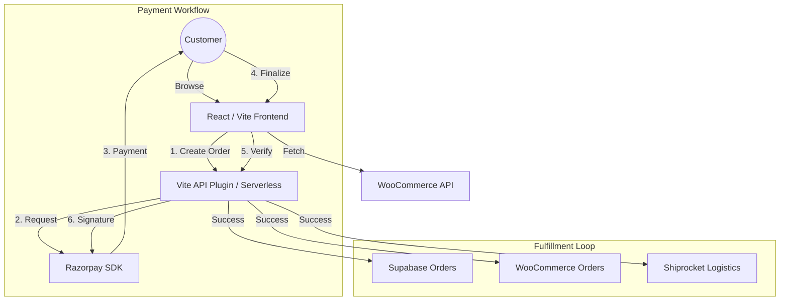

# Project Internal Architecture & Sync Logic

This document details the underlying infrastructure and synchronization logic that powers the **Bonny Velvet** e-commerce store.

---

## 🏗️ System Architecture

The project follows a **Modified JAMstack** architecture using Vite for the frontend and Vercel/Local-Middleware for the backend logic.

---

## 📡 Service Contexts

### 1. WooCommerce Integration (`src/services/woocommerce.ts`)
- **Live Catalog**: Products are fetched directly from WooCommerce to ensure a "Single Source of Truth" for stock and pricing.
- **Order Creation Relay**: Once payment is verified, we push the order data (Line Items, Customer Info, Razorpay Transaction ID) back to WooCommerce for store accounting.

### 2. Shiprocket Automation (`src/services/shiprocket.ts`)
- **Oauth Authentication**: Uses a valid email/password login to generate an ephemeral Bearer token.
- **ADHOC Order Creation**: Automatically creates "Custom Orders" in Shiprocket for every successful checkout, including full shipping weight and customer contact details.

### 3. Razorpay Bridge (`src/services/razorpay.ts`)
- **Key Environments**:
    - **Live Mode**: Uses production keys from `.env`.
    - **Mock Mode**: Automatically triggered if keys are missing or IDs start with `order_mock_`. Simulated verification returns a success status to allow full flow testing.
- **Verification Logic**: Uses `crypto-js` (HmacSHA256) to verify that the `razorpay_signature` matches the `razorpay_order_id` and `razorpay_payment_id`.

---

## 📦 Environment Variables

A successful deployment requires the following secrets:

| Variable | Source | Purpose |
| :--- | :--- | :--- |
| `VITE_SUPABASE_URL` | Supabase Settings | DB Connection |
| `VITE_SUPABASE_ANON_KEY` | Supabase Settings | Client-side Data Access |
| `VITE_WC_URL` | WordPress Site | API Base URL |
| `VITE_WC_CONSUMER_KEY` | WC > Settings > Advanced | Order/Product Access |
| `VITE_WC_CONSUMER_SECRET` | WC > Settings > Advanced | REST Authentication |
| `VITE_RAZORPAY_KEY_ID` | Razorpay Dashboard | Frontend API Key |
| `RAZORPAY_KEY_SECRET` | Razorpay Dashboard | Backend Verification |
| `VITE_SHIPROCKET_EMAIL` | Shiprocket Acc | Logistics Auth |
| `VITE_SHIPROCKET_PASSWORD`| Shiprocket Acc | Logistics Auth |

---

## 🛠️ Performance & Scalability

- **Caching**: Product and Category data is cached in `localStorage` via the `DataContext` to allow near-instant page loads for returning users.
- **Lazy Hydration**: Remote product details (specs, highlights) are dynamically mapped to IDs from `src/data/productEnrichment.ts` to keep bundle sizes minimal.
- **Global Error Boundary**: Critical syncs (WooCommerce/Shiprocket) are wrapped in independent `try-catch` blocks to ensure a single API failure doesn't block the legal "Success" state for the customer.

---
*Last Updated: April 2026*
